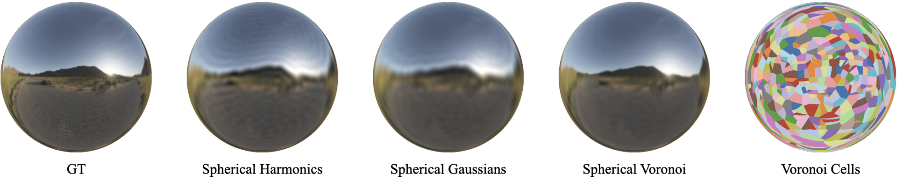

# Spherical Voronoi

**Directional Appearance as a Differentiable Partition of the Sphere** 🌐

📄 [Project Website](https://sphericalvoronoi.github.io/) | 📝 [arXiv Paper](https://arxiv.org/abs/2512.14180)

---

## Authors

**Francesco Di Sario**¹², **Daniel Rebain**³, **Dor Verbin**⁵, **Marco Grangetto**¹, **Andrea Tagliasacchi**²⁴

¹ University of Torino · ² Simon Fraser University · ³ University of British Columbia · ⁴ University of Toronto · ⁵ Google DeepMind

---

## Overview



Spherical functions like the shown environment maps have a multitude of applications in Computer Graphics and 3D Computer Vision. Classical representations like Spherical Harmonics optimize well but struggle in representing high-frequency functions. Explicit representations like Spherical Gaussians are capable of representing localized functions, but they are difficult to optimize due to the locality of the Gaussian kernel. **We propose Spherical Voronoi** as a new explicit representation that is capable of modeling high frequencies effectively, provides an adaptive decomposition of the spherical domain, and is easier to optimize.

---

## Repository Structure

This repository contains two main components:

- **`radiance/`** - Uses Spherical Voronoi instead of Spherical Harmonics (SH) for directional appearance. Backbone: Beta Splatting.
- **`reflection/`** - Uses Spherical Voronoi–parameterized light probes for reflections. Backbone: 2D Gaussian Splatting with differentiable rasterization.

---

## Installation

### Clone the repository

```bash
git clone https://github.com/sphericalvoronoi/sphericalvoronoi.git
```

### Install PyTorch

Install PyTorch according to your CUDA version following the [official instructions](https://pytorch.org/get-started/locally/).

---

## Modeling Radiance

### Setup

```bash
cd radiance
pip install -e .
pip install ./gsplat
pip install ./spherical-voronoi
```

### Training and Evaluation

Runnable commands are provided in `radiance/commands.txt`

A typical command is:

```bash
python train.py --eval \
  --source_path /DATASET_DIR/bonsai \
  --model_path ./output/voronoi/nerf_real_360/bonsai \
  --color_rep voronoi \
  --scene bonsai \
  --config ./config/indoor.json
```

The training script:
- Trains and evaluates the model
- Saves rendered images
- Reports **PSNR**, **SSIM**, **LPIPS**, and **FPS**

### Datasets

- [Mip-NeRF 360](https://jonbarron.info/mipnerf360/)
- [Tanks and Temples / Deep Blending](https://repo-sam.inria.fr/fungraph/3d-gaussian-splatting/datasets/input/tandt_db.zip)
- [NeRF Synthetic](https://drive.google.com/file/d/1OsiBs2udl32-1CqTXCitmov4NQCYdA9g/view?usp=drive_link)

---

## Reflection

### Setup

If not already installed, install PyTorch, torchvision, and torchaudio according to your CUDA version following the [official instructions](https://pytorch.org/get-started/locally/).

Install [PyTorch3D](https://github.com/facebookresearch/pytorch3d) and [nvdiffrast](https://github.com/NVlabs/nvdiffrast) following their respective official instructions.

Install repository submodules:

```bash
pip install -e submodules/diff-surfel-rasterization
pip install -e submodules/diff-surfel-rasterization-real
pip install -e submodules/diff-surfel-2dgs
pip install -e submodules/sv-probes
```

### Training and Evaluation

Runnable commands are provided in `reflection/commands.txt`

A typical command is:

```bash
python train.py --eval --m /DATASET_DIR -s /OUTPUT_DIR --rand_bg
```

The training script:
- Trains and evaluates the model
- Saves rendered images
- Reports **PSNR**, **SSIM**, **LPIPS**, and **FPS**

### Datasets

- [Ref-NeRF](https://storage.googleapis.com/gresearch/refraw360/ref.zip)
- [Ref-Real](https://storage.googleapis.com/gresearch/refraw360/ref_real.zip)
- [Glossy Synthetic](https://liuyuan-pal.github.io/NeRO/) (use `nero2blender.py` to convert to Blender format)

---

## Citation

If you use this work in your research, please cite:

```bibtex
@article{disario2025sphericalvoronoidirectionalappearance,
  title = {Spherical Voronoi: Directional Appearance as a Differentiable Partition of the Sphere},
  author = {Di Sario, Francesco and Rebain, Daniel and Verbin, Dor and Grangetto, Marco and Tagliasacchi, Andrea},
  journal = {arXiv preprint arXiv:2512.14180},
  year = {2025}
}
```

---

## Acknowledgments

This work builds upon several excellent open-source projects. We are grateful to the authors for making their code publicly available:

- [Beta Splatting](https://github.com/RongLiu-Leo/beta-splatting) 
- [2D Gaussian Splatting](https://github.com/hbb1/2d-gaussian-splatting) 
- [Ref-GS](https://github.com/YoujiaZhang/Ref-GS) 
- [3D Gaussian Splatting](https://github.com/graphdeco-inria/gaussian-splatting)
- [gsplat](https://github.com/nerfstudio-project/gsplat) 


---

## Contact

For questions or inquiries, please contact [Francesco Di Sario](mailto:francesco.disario@unito.it).