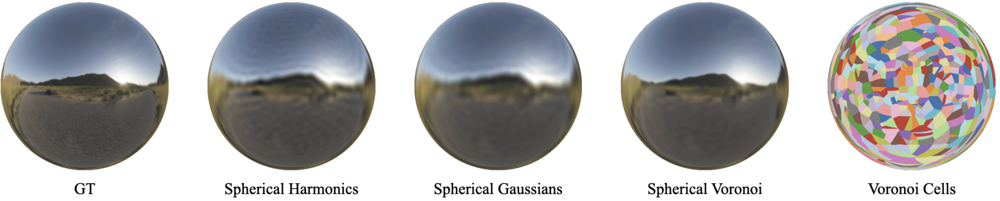

# Spherical Voronoi: Directional Appearance as a Differentiable Partition of the Sphere 

🏆 **Accepted at CVPR 2026**

📄 [Project Website](https://sphericalvoronoi.github.io/) | 📝 [arXiv Paper](https://arxiv.org/abs/2512.14180)

---

## Authors

**Francesco Di Sario**¹², **Daniel Rebain**³, **Dor Verbin**⁵, **Marco Grangetto**¹, **Andrea Tagliasacchi**²⁴

¹ University of Torino · ² Simon Fraser University · ³ University of British Columbia · ⁴ University of Toronto · ⁵ Google DeepMind

---

## Overview



Spherical functions like the shown environment maps have a multitude of applications in Computer Graphics and 3D Computer Vision. Classical representations like Spherical Harmonics optimize well but struggle in representing high-frequency functions. Explicit representations like Spherical Gaussians are capable of representing localized functions, but they are difficult to optimize due to the locality of the Gaussian kernel. **We propose Spherical Voronoi** as a new explicit representation that is capable of modeling high frequencies effectively, provides an adaptive decomposition of the spherical domain, and is easier to optimize.

---

## 🆕 Update — May 2026

This release brings significant improvements to Spherical Voronoi:

- **Native CUDA implementation** for the Spherical Voronoi kernel, delivering improved speed and stability.
- **Unified learning rates** across all models and datasets 
- **Improved results** across all benchmarks (see tables below).
- **All checkpoints** and evaluation renders are publicly available:
  📦 [Google Drive](https://drive.google.com/drive/folders/1OrIw3LQGqHffPK7KcRnP_ZZMT6gWR88Q?usp=sharing)
- **Release** of Spherical Voronoi for [3DGS-MCMC](https://github.com/sphericalvoronoi/3dgs-mcmc) and [2DGS](https://github.com/sphericalvoronoi/2dgs).

> ⚠️ **Important — MipNeRF-360 evaluation:** For correct and fair evaluation, use the **`images_2`** folder for indoor scenes and **`images_4`** for outdoor scenes. Do **not** use manual downsampling via the `-r` flag.

### Results — Beta Splatting + Spherical Voronoi

| Dataset | PSNR | SSIM | LPIPS |
|---|---|---|---|
| MipNeRF-360 | 28.71 | 0.837 | 0.228 |
| Tanks & Temples | 25.00 | 0.874 | 0.170 |
| Deep Blending | 30.63 | 0.917 | 0.298 |
| Blender | 34.58 | 0.973 | 0.032 |

### Results — 3DGS-MCMC + Spherical Voronoi

| Dataset | PSNR | SSIM | LPIPS |
|---|---|---|---|
| MipNeRF-360 | 28.51 | 0.837 | 0.220 |
| Tanks & Temples | 24.67 | 0.867 | 0.186 |
| Deep Blending | 30.04 | 0.905 | 0.315 |
| Blender | 34.35 | 0.973 | 0.034 |

### Results — 2DGS + Spherical Voronoi

| Dataset | PSNR | SSIM | LPIPS |
|---|---|---|---|
| Blender | 33.56 | 0.969 | 0.039 |
| MipNeRF-360 | 27.70 | 0.807 | 0.279 |

---

## Repository Structure

This repository contains two main components:

- **`radiance/`** - Uses Spherical Voronoi instead of Spherical Harmonics for directional appearance. Backbone: Beta Splatting.
- **`reflection/`** - Uses Spherical Voronoi–parameterized light probes for reflections. Backbone: 2D Gaussian Splatting with deferred rendering.

---

## Installation

### Clone the repository

```bash
git clone https://github.com/sphericalvoronoi/sphericalvoronoi.git
```

### Install PyTorch

Install PyTorch according to your CUDA version following the [official instructions](https://pytorch.org/get-started/locally/).

---

## Modeling Radiance

### Setup

```bash
cd radiance
pip install -e .
pip install ./gsplat
pip install ./spherical-voronoi
```

### Training and Evaluation

Ready-to-run scripts are provided in the `scripts/` folder. For example:

```bash
# Edit $DATA_ROOT inside the script to point to your dataset
bash scripts/train_mipnerf360.sh
bash scripts/eval_mipnerf360.sh
```

A typical manual command is:

```bash
python train.py --eval \
  --source_path /DATASET_DIR/bonsai \
  --model_path ./output/voronoi/nerf_real_360/bonsai \
  --color_rep voronoi \
  --scene bonsai \
  --config ./config/indoor.json
```

The training script:
- Trains and evaluates the model
- Saves rendered images
- Reports **PSNR**, **SSIM**, **LPIPS**

### Datasets

- [Mip-NeRF 360](https://jonbarron.info/mipnerf360/)
- [Tanks and Temples / Deep Blending](https://repo-sam.inria.fr/fungraph/3d-gaussian-splatting/datasets/input/tandt_db.zip)
- [NeRF Synthetic](https://drive.google.com/file/d/1OsiBs2udl32-1CqTXCitmov4NQCYdA9g/view?usp=drive_link)

---

## Reflection

### Setup

```bash
cd reflection
pip install -e submodules/diff-surfel-rasterization
pip install -e submodules/diff-surfel-rasterization-real
pip install -e submodules/diff-surfel-2dgs
pip install -e submodules/sv-probes
```

**Note:** You will also need [PyTorch3D](https://github.com/facebookresearch/pytorch3d) and [nvdiffrast](https://github.com/NVlabs/nvdiffrast).

### Training and Evaluation

Ready-to-run scripts are provided in the `scripts/` folder. A typical manual command is:

```bash
python train.py --eval --m /OUTPUT_DIR -s /DATASET_DIR --rand_bg
```

The training script:
- Trains and evaluates the model
- Saves rendered images
- Reports **PSNR**, **SSIM**, **LPIPS**, and **FPS**

### Datasets

- [Ref-NeRF](https://storage.googleapis.com/gresearch/refraw360/ref.zip)
- [Ref-Real](https://storage.googleapis.com/gresearch/refraw360/ref_real.zip)
- [Glossy Synthetic](https://liuyuan-pal.github.io/NeRO/) (use `nero2blender.py` to convert to Blender format)

---

## Citation

If you use this work in your research, please cite:

```bibtex
@article{disario2025sphericalvoronoidirectionalappearance,
  title = {Spherical Voronoi: Directional Appearance as a Differentiable Partition of the Sphere},
  author = {Di Sario, Francesco and Rebain, Daniel and Verbin, Dor and Grangetto, Marco and Tagliasacchi, Andrea},
  journal = {arXiv preprint arXiv:2512.14180},
  year = {2025}
}
```

---

## Acknowledgments

This work builds upon several excellent open-source projects. We are grateful to the authors for making their code publicly available:

- [Beta Splatting](https://github.com/RongLiu-Leo/beta-splatting)
- [2D Gaussian Splatting](https://github.com/hbb1/2d-gaussian-splatting)
- [Ref-GS](https://github.com/YoujiaZhang/Ref-GS)
- [gsplat](https://github.com/nerfstudio-project/gsplat)

---

## Contact

For questions or inquiries, please contact [Francesco Di Sario](mailto:francesco.disario@unito.it).

---

## Full Results Tables

<summary><b>Beta Splatting + Spherical Voronoi — per scene</b></summary>

| Dataset | Scene | PSNR | SSIM | LPIPS |
|---|---|---|---|---|
| MipNeRF-360 | bonsai | 34.87 | 0.957 | 0.231 |
| | kitchen | 32.98 | 0.937 | 0.147 |
| | room | 33.26 | 0.937 | 0.257 |
| | counter | 31.04 | 0.930 | 0.225 |
| | bicycle | 25.75 | 0.795 | 0.196 |
| | garden | 27.92 | 0.876 | 0.114 |
| | flowers | 22.18 | 0.639 | 0.337 |
| | stump | 27.32 | 0.806 | 0.211 |
| | treehill | 23.08 | 0.656 | 0.333 |
| | **avg** | **28.71** | **0.837** | **0.228** |
| Tanks & Temples | train | 23.25 | 0.845 | 0.214 |
| | truck | 26.76 | 0.904 | 0.125 |
| | **avg** | **25.00** | **0.874** | **0.170** |
| Deep Blending | drjohnson | 29.96 | 0.914 | 0.304 |
| | playroom | 31.30 | 0.920 | 0.292 |
| | **avg** | **30.63** | **0.917** | **0.298** |
| Blender | lego | 37.15 | 0.986 | 0.015 |
| | mic | 37.39 | 0.994 | 0.006 |
| | ship | 31.49 | 0.911 | 0.117 |
| | chair | 37.18 | 0.990 | 0.012 |
| | ficus | 36.93 | 0.991 | 0.009 |
| | hotdog | 38.49 | 0.988 | 0.020 |
| | materials | 30.98 | 0.967 | 0.036 |
| | drums | 27.05 | 0.959 | 0.037 |
| | **avg** | **34.58** | **0.973** | **0.032** |


<summary><b>3DGS-MCMC + Spherical Voronoi — per scene</b></summary>

| Dataset | Scene | PSNR | SSIM | LPIPS |
|---|---|---|---|---|
| MipNeRF-360 | bonsai | 34.15 | 0.952 | 0.244 |
| | kitchen | 32.79 | 0.934 | 0.156 |
| | room | 32.66 | 0.932 | 0.269 |
| | counter | 31.06 | 0.938 | 0.135 |
| | bicycle | 25.72 | 0.796 | 0.202 |
| | garden | 27.87 | 0.878 | 0.110 |
| | flowers | 22.01 | 0.638 | 0.327 |
| | stump | 27.41 | 0.810 | 0.207 |
| | treehill | 22.95 | 0.654 | 0.331 |
| | **avg** | **28.51** | **0.837** | **0.220** |
| Tanks & Temples | train | 22.92 | 0.833 | 0.238 |
| | truck | 26.42 | 0.901 | 0.134 |
| | **avg** | **24.67** | **0.867** | **0.186** |
| Deep Blending | drjohnson | 29.45 | 0.894 | 0.323 |
| | playroom | 30.63 | 0.917 | 0.306 |
| | **avg** | **30.04** | **0.905** | **0.315** |
| Blender | lego | 36.45 | 0.985 | 0.018 |
| | mic | 37.71 | 0.995 | 0.006 |
| | ship | 31.36 | 0.912 | 0.119 |
| | chair | 36.96 | 0.989 | 0.015 |
| | ficus | 35.87 | 0.989 | 0.011 |
| | hotdog | 38.39 | 0.988 | 0.023 |
| | materials | 31.06 | 0.967 | 0.038 |
| | drums | 27.03 | 0.959 | 0.038 |
| | **avg** | **34.35** | **0.973** | **0.034** |


<summary><b>2DGS + Spherical Voronoi — per scene</b></summary>

| Dataset | Scene | PSNR | SSIM | LPIPS |
|---|---|---|---|---|
| MipNeRF-360 | bonsai | 33.37 | 0.943 | 0.267 |
| | room | 31.81 | 0.919 | 0.304 |
| | counter | 29.91 | 0.909 | 0.274 |
| | kitchen | 32.05 | 0.926 | 0.169 |
| | bicycle | 24.87 | 0.741 | 0.282 |
| | garden | 27.26 | 0.853 | 0.149 |
| | flowers | 21.21 | 0.589 | 0.386 |
| | stump | 26.35 | 0.760 | 0.278 |
| | treehill | 22.43 | 0.621 | 0.406 |
| | **avg** | **27.70** | **0.807** | **0.279** |
| Blender | lego | 35.62 | 0.981 | 0.023 |
| | mic | 35.46 | 0.991 | 0.008 |
| | ship | 30.92 | 0.906 | 0.130 |
| | chair | 35.75 | 0.986 | 0.018 |
| | hotdog | 37.80 | 0.985 | 0.028 |
| | ficus | 36.25 | 0.989 | 0.013 |
| | materials | 29.98 | 0.960 | 0.046 |
| | drums | 26.69 | 0.956 | 0.044 |
| | **avg** | **33.56** | **0.969** | **0.039** |
